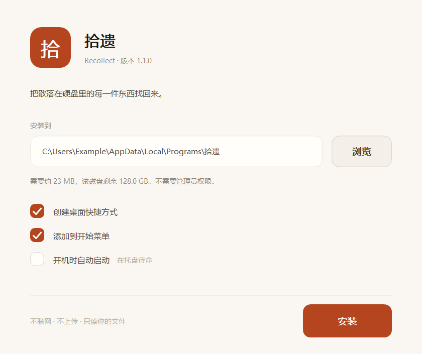

<div align="center">


# Recollect · 拾遗

**Find every single thing you ever made, scattered across your disk.**

A local archive that reads the *text inside* your Word, PowerPoint, Excel, PDF,
code and notes — so you can search for the sentence you wrote,
not just the filename you forgot.

No cloud. No account. No network. Reads your files, never changes them.

[简体中文](README.zh-CN.md) · [Changelog](CHANGELOG.md) · [Android app](android/README.md)

</div>

---


## What it does

Most search tools match filenames. Recollect indexes the **body text**:

- Search `红绿灯` and it finds the phrase inside a `.pptx`, telling you it's on slide 3
- Search a term from a 120,000-character exam PDF and it lands on that PDF
- Type two Chinese characters — the case where trigram indexes give up — and it still works

It also tells you two things you probably don't know about your own disk:

| | |
|---|---|
| **Version pile-ups** | You kept `report.docx`, `report-revised.docx`, `report-final.docx`. It groups them, marks the newest, and tells you what you'd reclaim by keeping one |
| **Content duplicates** | Files with different names but byte-identical text — the same deck sitting in three folders |

It **never deletes anything**. It lays out the facts; what to remove is your call.

<br>

## Install



**Windows — installer** (recommended)

Download `recollect-1.1.1-setup.exe` (~20 MB) from [Releases](../../releases) and
double-click it. It installs under your own user account, so it never asks for
administrator rights, and it registers in *Settings → Apps* like any other
program — with an uninstaller that actually works.

For unattended setup it also runs without a UI:

```bash
recollect-1.1.1-setup.exe --silent --dir "D:\Tools\拾遗" --autostart
```

`--help` lists every flag. A silent install exits 0, or 1 with the reason on
stderr.

**Windows — portable**

Don't want an installer? Run `tools\打包.bat` (or
`python tools/build_installer.py`) and take `dist/拾遗/` instead — the whole
folder is portable, copy it anywhere and it runs, leaving no registry entry
behind.

**With Python 3.10+**

```bash
pip install -e .
shiyi                 # starts in the tray, opens a window
```

**Android** — grab `recollect-1.1.1.apk` (1.1 MB) from
[Releases](../../releases), or see [android/README.md](android/README.md).

### Uninstalling

*Settings → Apps → 拾遗 Recollect → Uninstall*, or run `拾遗.exe --uninstall`.
It asks once whether to delete the index too; leave it unchecked and a later
reinstall picks up exactly where you left off. Your documents are never touched.

<br>

## How it lives on your machine

It sits in the **system tray** as a vermillion 拾 seal.

- **Left-click** the icon — open the window
- **Right-click** — scan now / open the index folder / view logs / quit
- **Close the window** — it doesn't quit; it stays in the tray, ready
- **Click the desktop icon again** — raises the window you already have open,
  it never starts a second copy

The window opens through Edge or Chrome's `--app` mode: no address bar, no tabs,
and a **separate user-data directory** so it shares nothing with your everyday
browser — no cookies, no history, and closing it doesn't touch your open pages.
Falls back to the default browser if neither is installed.

Every hour (configurable) it runs an incremental scan in the background.
150,000 files takes about 9 seconds, so you never have to remember to refresh.

<br>

## Six screens

### Search

`/` focuses the box · `↑ ↓` moves · `Enter` opens · `Shift+Enter` reveals in the
file manager · `Esc` clears · `Ctrl+1..4` switches screens.

The right pane reads the full extracted text; slides are marked page by page.
Sort by relevance, time or size; filter by kind; export results to CSV.

Queries of three characters or more go through the trigram index — typically
**1 ms**. One or two characters can't form a trigram, so those fall back to a
direct scan of the body text, around **140 ms**.

Searches are deep-linkable: `?q=红绿灯` and `#tidy` both work, so a result set or
a screen can be bookmarked and shared.

### Projects

Picks out which directories are actually *a project* — the ones with a
`package.json`, `build.gradle`, `.ino`, or `.git`. An Android project leaves
markers at three nesting levels; only the outermost one counts.

Unpacked archives and installers are dimmed. Their files all share one
modification hour, which means they were written in a single burst — not built
by a person over time.

### Tidy


Version pile-ups, content duplicates, and projects you once invested in but
haven't touched in months.

**Your directories only.** Downloads, messenger file caches, cloud-sync temp
folders, and files shipped with game mods or toolchains are all excluded —
38 identically-named `documentation.md` files inside a game mod are not "38
versions you saved", and neither are 20 copies of a timetable in a chat cache.
Adding that one rule took version pile-ups from 630 groups down to 4, every one
of them real.

### Yearbook

Translates a pile of files into *what you made this year*: how many artifacts,
how many words, the busiest month, the most active projects. Exports as a
single self-contained HTML page — `Ctrl+P` turns it into a PDF.

`gradle-wrapper.jar` and `node.exe` don't count as your work. An `.apk` you
built yourself does.

### Settings

Scan roots, extra exclusions, whether to index body text and up to what length,
auto-scan interval, appearance (system / light / dark), start with Windows,
create shortcuts.

Appearance and autostart apply immediately. Everything else needs **Save**, and
until you do there's a small dot on the sidebar reminding you.

### About

Version and environment, index health check, keyboard reference, logs, quit and
uninstall. Index maintenance offers **check**, **compact**, **rebuild** and
**clear** — none of which touch your original files.

<br>

## On your phone

 

The same thing, on Android — see [android/README.md](android/README.md).

<br>

## Command line

```bash
shiyi                      # run as an app (tray + window)
shiyi doctor               # self-check: environment, index, config
shiyi doctor --deep        # include a SQLite integrity check

shiyi scan                 # incremental scan
shiyi scan --full          # ignore the cache, re-read everything
shiyi search <query>       # search
shiyi projects             # list detected projects
shiyi clusters             # version pile-ups
shiyi dups                 # content duplicates
shiyi year 2026            # yearbook
shiyi export 2026          # export the yearbook as HTML

shiyi install              # desktop + start menu shortcuts
shiyi install --autostart  # …and start with Windows
shiyi autostart on|off
shiyi uninstall            # remove shortcuts and autostart (--purge drops the index)

shiyi serve                # web service only, no tray
shiyi log / where / reset
```

<br>

## What it scans, and what it refuses to

Default roots: `Documents`, `Desktop`, `Downloads`, `OneDrive`. Editable in Settings.

**Never walked**: `node_modules`, `.git`, `AppData`, `build`/`dist`, Minecraft's
`versions`/`libraries`, messenger private databases (`db_storage`, `.db-wal`,
`.material`), plus anything you exclude yourself.

**Cloud placeholders**: OneDrive files that aren't downloaded locally are indexed
by name only and never opened — opening one triggers a download, and on the
machine this was built for 78% of OneDrive files were placeholders. Scanning
naively would have pulled the entire drive down.

**Bulk plain text**: a directory holding more than 4 MB of raw text (game mod
language files, toolchain docs, a bundled Python's test suite) gets filenames
indexed but no body extraction. This rule deliberately does **not** apply to
docx/pptx/pdf — those are zip containers where file size says nothing about word
count. An earlier version measured by size and wiped out a legitimate folder of
exam papers.

<br>

## About the PDF reader

There's no pypdf and no MuPDF here. PDF text is extracted from scratch:
inflate `FlateDecode` streams, expand object streams, parse the `/ToUnicode`
CMap into a code-point → character table, run a small PostScript tokenizer over
the content stream to catch the text-showing operators, then re-sort the
fragments by their position on the page into reading order.

Chinese PDFs exported from Word, PowerPoint or LaTeX all read fine.
**Scans do not** — they're images with no text layer, and the UI says exactly
that rather than pretending it succeeded.

<br>

## Where your data lives

```
%USERPROFILE%\.shiyi\
  shiyi.db        the index (~420 MB for 150,000 files)
  config.json     settings
  shiyi.log       rotating log, 3 files kept
  runtime.json    the port and token of the running instance
  window\         the app window's isolated browser profile
```

Delete that folder and it's as if the app was never installed.
Not one byte of your original files changes.

<br>

## What it will never do

- Go online, upload anything, or ask for an account or API key
- Delete, move or rename any of your files
- OCR a scan (if it can't read it, it says so)
- Listen on anything but `127.0.0.1`. Side-effecting endpoints require a
  one-time token generated at startup, so no other web page can reach them, and
  the only paths it can open are ones already in the index

<br>

## Troubleshooting

Run `shiyi doctor` first — it checks environment, index and config in one shot.
Then read `~/.shiyi/shiyi.log` (also visible under About → Logs).

| Symptom | Cause |
|---|---|
| Chinese search finds nothing | Check the FTS5 line in `doctor`; without trigram you need a different Python |
| No window appeared | No Edge/Chrome — it falls back to the default browser |
| Port in use | It moves to the next free port; `runtime.json` has the real one |
| Double-click does nothing | It's already in the tray — look for the 拾 seal |

<br>

## Development

```bash
python -m unittest discover -s tests   # 85 tests
python tools/make_icon.py              # regenerate the icon
python tools/build_exe.py              # the app alone (--onefile for one exe)
python tools/build_installer.py        # the app, then the installer around it
```

Tests cover text extraction, PDF CMap parsing and layout reconstruction, both
Chinese search paths, incremental scan and deletion, the edges of version
clustering (24 READMEs are not a "version pile-up"), config tolerance, single
instance, index maintenance, yearbook HTML escaping — plus a real running
server: missing/wrong token and cross-origin requests must be rejected, paths
outside the index must not open, and directory traversal must 404. The
installer's own tests use a throwaway registry key, so running them never
disturbs a real installation.

| File | Role |
|---|---|
| `app.py` | Application shell: single instance, tray, window, scheduled scan |
| `server.py` | Local HTTP service and JSON API |
| `scan.py` | Walking and incremental indexing |
| `store.py` | SQLite + FTS5, search and maintenance |
| `textract.py` | docx / pptx / xlsx / plain-text extraction |
| `pdftext.py` | PDF text extraction, standard library only |
| `projects.py` | Project detection, version clustering, duplicate detection |
| `timeline.py` | Timeline and yearbook statistics |
| `report.py` | Yearbook HTML export |
| `tray.py` | Win32 tray icon, pure ctypes |
| `winui.py` | A thin Win32 UI layer: GDI+ for shapes, GDI for text |
| `installer.py` | The install and uninstall wizards, and their logic |
| `window.py` | Application window |
| `winintegration.py` | Autostart, shortcuts, uninstall |

Zero runtime dependencies is a design goal, not an omission.
PyInstaller is needed only to build the executable.

MIT License.
