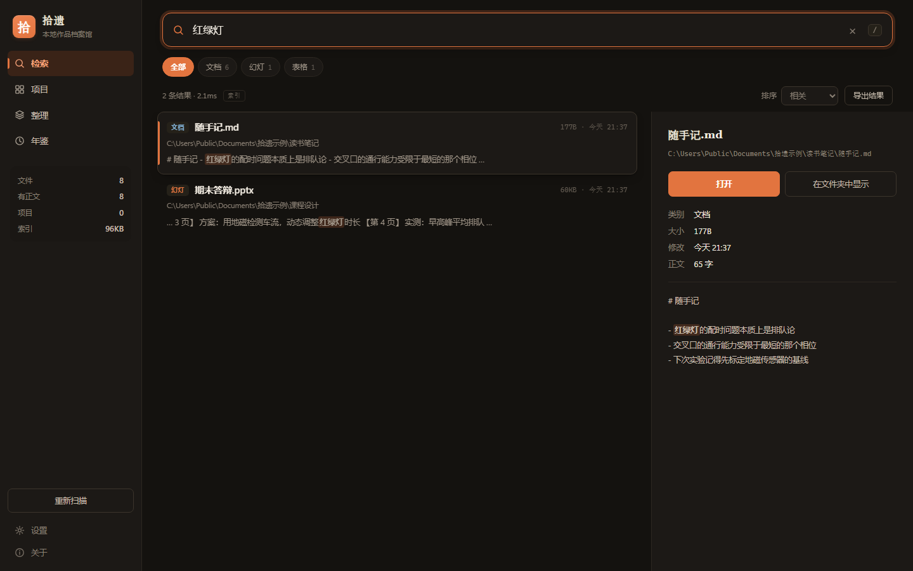
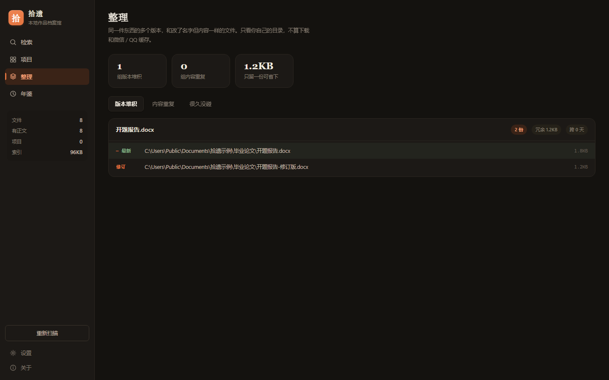

<div align="center">


# 拾遗 · Recollect

**把散落在硬盘里的每一件东西找回来。**

一个跑在你自己电脑上的作品档案馆。它把你写过的所有 Word、PPT、Excel、PDF、
代码和笔记读进一个本地索引，然后让你用一句话把它们找出来——
不是找文件名，是找**你当时写下的那句话**。

不联网、不上传、不需要账号。只读你的文件，从不改动它们。

[English](README.md) · [更新记录](CHANGELOG.zh-CN.md) · [安卓版](android/README.zh-CN.md)

</div>

---



## 它做什么

大多数搜索工具只匹配文件名。拾遗索引的是**正文**：

- 搜「红绿灯」，它会翻出藏在 `.pptx` 里的那句话，并告诉你在第 3 页
- 搜一份十二万字生物试卷 PDF 里的某个词，它能直接落到那份 PDF 上
- 输两个汉字——正是 trigram 索引失效的情况——它照样找得到

它还会告诉你两件关于自己硬盘的事：

| | |
|---|---|
| **版本堆积** | 你留着 `报告.docx`、`报告-修订版.docx`、`报告-最终版.docx`。它把这些归成一簇，标出最新的那份，算出只留一份能省多少 |
| **内容重复** | 名字不同但正文一模一样的文件——同一份 PPT 躺在三个文件夹里 |

它**不会删任何东西**。它只负责把事实摆出来，删不删你自己决定。

<br>

## 装上它

**Windows，不需要 Python**

双击 `打包成exe.bat` 生成 `dist/拾遗/拾遗.exe`（约 24 MB），之后双击运行。
整个 `dist/拾遗` 文件夹可以拷到别的电脑上直接用。

**有 Python 3.10 以上**

```bash
pip install -e .
shiyi                 # 启动，进托盘并打开窗口
```

**安卓** —— 从 [Releases](../../releases) 下 `app-release.apk`（1.1 MB），
细节见 [android/README.zh-CN.md](android/README.zh-CN.md)。

<br>

## 它怎么待着

启动后在**系统托盘**里常驻，图标是一枚朱砂色的「拾」印。

- **左键点图标** —— 打开窗口
- **右键点图标** —— 立即扫描 / 打开索引目录 / 查看日志 / 退出
- **关掉窗口** —— 不退出，继续待在托盘里，随时能搜
- **再点一次桌面图标** —— 唤起已经开着的那个，不会起第二份

窗口用 Edge 或 Chrome 的 `--app` 模式打开：没有地址栏、没有标签页，
用的是**独立配置目录**，跟你平时的浏览器完全隔开——不共享 Cookie、
不进浏览历史、关掉也不影响你原来开的网页。找不到 Edge/Chrome 就退回默认浏览器。

它每隔一小时（可调）在后台做一次增量扫描，15 万文件大约 9 秒，你不用记得点。

<br>

## 六个页面

### 检索

`/` 跳到搜索框 · `↑ ↓` 移动 · `Enter` 打开 · `Shift+Enter` 在文件夹中显示 ·
`Esc` 清空 · `Ctrl+1..4` 切换页面。

右侧能直接读全文，幻灯会逐页标出。可以按相关度 / 时间 / 大小排序，
可以只看某一类文件，可以把结果导出成 CSV。

三个字以上走 trigram 索引，通常 **1 毫秒**；一到两个字组不出三元组，
改成直接扫正文，约 **140 毫秒**。

检索可以做成链接：`?q=红绿灯` 和 `#tidy` 都有效，一组结果或某个页面
可以收藏、可以发给别人。

### 项目

从几万个目录里认出哪些是「一个项目」——有 `package.json`、`build.gradle`、
`.ino`、`.git` 的地方。安卓工程会在三层目录留下标记，只取最外层那个。

解压包和安装目录会被标灰：它们的所有文件修改时间挤在同一小时里，
一看就是被一次性写出来的，不是一个人一点点做出来的。

### 整理



版本堆积、内容重复，以及曾经投入不少、最近半年没动过的项目。

**只看你自己的目录。** 下载目录、聊天软件的文件缓存、网盘临时目录、
以及模组和工具链自带的文件，都不参与统计——游戏模组里 38 个同名的
`documentation.md` 不是「你存了 38 版」，聊天缓存里 20 份课程表也不是。
加上这一条规则，版本堆积从 630 组降到 4 组，每一组都是真的。

### 年鉴

把一堆文件翻译成**你今年做了什么**：做出多少件成品、写了多少万字、
最忙的是哪个月、最活跃的项目是哪几个。可以导出成一页独立 HTML，
`Ctrl+P` 就能存成 PDF。

`gradle-wrapper.jar` 和 `node.exe` 不算你的作品，你自己编的 `.apk` 算。

### 设置

扫描目录、额外排除项、要不要索引正文及长度上限、自动扫描间隔、
外观（跟随系统 / 浅色 / 深色）、开机自启、创建快捷方式。

外观和开机自启点了立刻生效；其余改动要点**保存**，没保存时侧栏上
会有个小圆点提醒你。

### 关于

版本与运行环境、索引体检、快捷键一览、日志、退出与卸载。
索引维护有**体检**、**整理碎片**、**重建**、**清空**四个动作，
无论哪个都不会动你的原始文件。

<br>

## 手机上也有一个

 

同一个东西的安卓版，细节见 [android/README.zh-CN.md](android/README.zh-CN.md)。

<br>

## 命令行

```bash
shiyi                      # 当软件启动（托盘 + 窗口）
shiyi doctor               # 自检：环境、索引、配置
shiyi doctor --deep        # 连数据库完整性一起查

shiyi scan                 # 扫描（增量）
shiyi scan --full          # 忽略缓存，全部重读
shiyi search <词>          # 检索
shiyi projects             # 列出项目
shiyi clusters             # 版本堆积
shiyi dups                 # 内容重复
shiyi year 2026            # 年鉴
shiyi export 2026          # 把年鉴导出成 HTML

shiyi install              # 创建桌面和开始菜单快捷方式
shiyi install --autostart  # 顺便设开机自启
shiyi autostart on|off
shiyi uninstall            # 删快捷方式和自启（--purge 连索引一起删）

shiyi serve                # 只起网页服务，不进托盘
shiyi log / where / reset
```

<br>

## 它扫哪里，又拒绝碰哪里

默认根目录：`Documents`、`Desktop`、`Downloads`、`OneDrive`，在设置里可改。

**从不走进去**：`node_modules`、`.git`、`AppData`、各种 `build`/`dist`、
Minecraft 的 `versions`/`libraries`、聊天软件的私有数据库
（`db_storage`、`.db-wal`、`.material`），以及你自己加的排除项。

**云端占位文件**：OneDrive 里没下载到本地的文件只索引文件名，绝不打开——
打开一个就会触发下载。开发这套东西的那台机器上，OneDrive 有 78% 是占位文件，
傻乎乎地扫一遍等于把整个网盘拖下来。

**大堆纯文本**：一个目录里塞了 4MB 以上裸文本（游戏模组的语言文件、
工具链自带的文档、内嵌 Python 的测试用例），只索引文件名不抽正文。
这条规则刻意**不**适用于 docx / pptx / pdf——那些是压缩包，
体积大不代表字多。早期版本按体积算，把一整个正经的试卷文件夹误伤过。

<br>

## 关于 PDF

这里没有 pypdf，也没有 MuPDF。PDF 正文是从零解出来的：
解 `FlateDecode` 流、展开对象流、把 `/ToUnicode` CMap 解析成
「码位 → 字符」表、在内容流上跑一个小型 PostScript 词法器抓取绘字指令，
最后按文字在页面上的坐标重排成阅读顺序。

Word / PowerPoint / LaTeX 导出的中文 PDF 都能读。**扫描件读不出来**——
那是一张张图片，没有文字层，界面上会如实标成「扫描件，无正文」，
而不是假装成功。

<br>

## 数据在哪

```
%USERPROFILE%\.shiyi\
  shiyi.db        索引（15 万个文件约 420MB）
  config.json     配置
  shiyi.log       日志，自动轮转最多留 3 份
  runtime.json    正在运行的端口和令牌
  window\         应用窗口的独立浏览器配置
```

删掉整个目录，就像从没装过。你的原始文件一个字节都不会变。

<br>

## 它永远不会做的事

- 联网、上传、要求账号或 API key
- 删除、移动、重命名你的任何文件
- 给扫描件做 OCR（读不出来就说读不出来）
- 监听 `127.0.0.1` 以外的地址。有副作用的接口都要带启动时生成的一次性
  token，别的网页够不着；能打开的路径必须已经在索引里

<br>

## 出问题了

先跑 `shiyi doctor`，它把环境、索引、配置一次查完。
再看 `~/.shiyi/shiyi.log`（软件里「关于 → 日志」也能直接看）。

| 症状 | 原因 |
|---|---|
| 中文搜不到 | 看 `doctor` 里的 FTS5 那行；没有 trigram 就得换个 Python |
| 窗口没弹出来 | 没装 Edge/Chrome，会退回默认浏览器 |
| 端口被占 | 会自动往后挪，`runtime.json` 里是实际端口 |
| 双击没反应 | 多半已经在托盘里跑着了，找那枚「拾」印 |

<br>

## 开发

```bash
python -m unittest discover -s tests   # 71 个测试
python tools/make_icon.py              # 重新生成图标
python tools/build_exe.py              # 打包（--onefile 出单文件）
```

测试覆盖正文抽取、PDF 的 CMap 解析与版面还原、中文检索的两条路径、
增量扫描与删除、版本聚簇的边界（24 个 README 不算「版本堆积」）、
配置容错、单实例、索引维护、年鉴的 HTML 转义，以及一个真跑起来的服务端：
无 token / 错 token / 跨源请求必须被拒，索引外的路径不许打开，目录穿越要 404。

| 文件 | 干什么 |
|---|---|
| `app.py` | 应用外壳：单实例、托盘、窗口、定时扫描 |
| `server.py` | 本地 HTTP 服务与 JSON 接口 |
| `scan.py` | 扫描与增量索引 |
| `store.py` | SQLite + FTS5，检索与维护 |
| `textract.py` | docx / pptx / xlsx / 纯文本抽取 |
| `pdftext.py` | 纯标准库 PDF 正文抽取 |
| `projects.py` | 项目识别、版本聚簇、重复检测 |
| `timeline.py` | 时间线与年鉴统计 |
| `report.py` | 年鉴 HTML 导出 |
| `tray.py` | Win32 托盘，纯 ctypes |
| `window.py` | 应用窗口 |
| `winintegration.py` | 开机自启、快捷方式、卸载 |

运行时零依赖是设计目标，不是还没来得及加。
PyInstaller 只在打包时用得到。

MIT 许可证。
