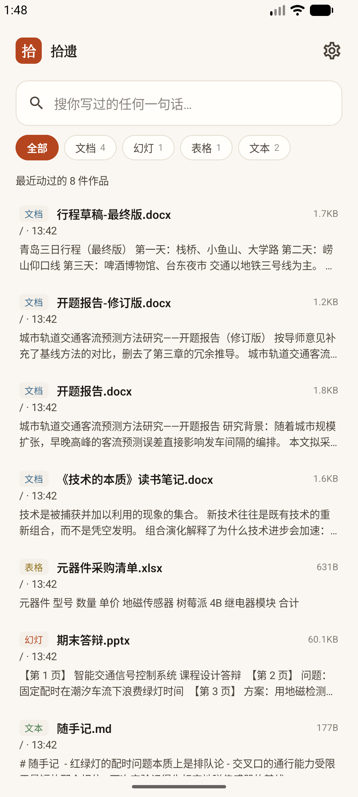
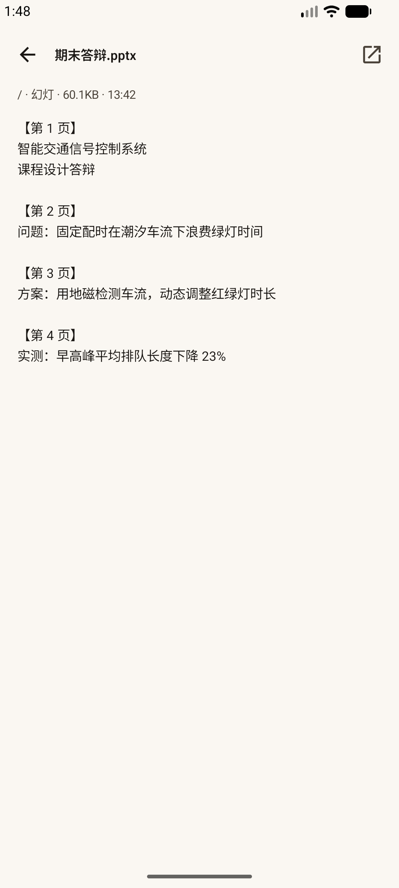

# Recollect for Android · 拾遗

[简体中文](README.zh-CN.md)

**Find every single thing you ever made, scattered across your phone.**

The same product and the same design language as the desktop app: it reads the
**body text** of your Word, PowerPoint, Excel and notes, so one phrase is enough
to find them again.

Read-only, offline, no account.

 

<br>

## Install

Grab `app-release.apk` (~1.1 MB) from [Releases](../../../releases), copy it to
your phone and open it. You'll need to allow installing from unknown sources.

Build it yourself:

```bash
build.bat            # debug
build.bat release    # release
build.bat install    # build and adb-install to a connected device
```

Requires JDK 17+ (the script defaults to the JBR bundled with Android Studio)
and Android SDK 36.

### Signing

The signing keystore is not in the repository. Release builds succeed without
it — they just come out unsigned. For a key you can keep upgrading over,
generate your own:

```bash
keytool -genkeypair -keystore app/shiyi.jks -alias shiyi \
        -keyalg RSA -keysize 2048 -validity 36500
```

Passwords can be overridden with `SHIYI_KEYSTORE_PASSWORD`,
`SHIYI_KEY_PASSWORD` and `SHIYI_KEY_ALIAS`. **Don't lose the key** — change it
and you can no longer install over an existing copy.

<br>

## How it sees your files

**Only folders you hand it, explicitly.** It uses Android's Storage Access
Framework: pick a folder on first launch, add or remove more in Settings later.

It deliberately does **not** request `MANAGE_EXTERNAL_STORAGE` (all-files
access). A permission scope you can state in one sentence is more honest than
"allow access to all files".

Two restrictions come from Android itself, not from the app:

| Can't be granted | Why |
|---|---|
| Root of internal storage | Blocked since Android 11 — apps must not grab everything at once |
| The `Download` root | Same rule. Pick a **subfolder** of it instead |

Start with `Documents`.

<br>

## What it can read

| Format | Body text |
|---|---|
| `.docx` `.pptx` `.xlsx` | ✅ OOXML parsed directly; slides are marked page by page |
| `.txt` `.md`, source code | ✅ UTF-8 first, GB18030 as a fallback |
| `.pdf` | ❌ filename only |
| Images / video / audio / archives | Filename only |

**Why no PDF text on mobile**: it needs FlateDecode, object-stream expansion and
`/ToUnicode` CMap parsing. The desktop version does all of that (400-odd lines),
but carrying it on a phone for a handful of PDFs isn't worth it. The UI says so
plainly instead of pretending it read them.

<br>

## How search works

**No FTS.** A phone holds hundreds to a few thousand documents — call it a dozen
megabytes of text — and a straight `LIKE` scan over that takes a few
milliseconds. Meanwhile FTS5's trigram tokenizer (what the desktop version uses
for Chinese substring search) needs SQLite 3.34+, which Android only reliably
has from 12 onward. Trading compatibility for a speedup you don't need is a bad
deal.

Typing is debounced by 120 ms — people type faster than a query needs to run.

<br>

## Design language

The same *paper and seal* system as the desktop app:

- **Paper** — content rests on warm white; depth comes from light, not borders
- **Seal** — the vermillion accent is reserved for three things: current
  location, primary action, search highlight
- **Ink** — type carries weight: the name heaviest, the path lightest

Motion follows Material 3's scale: 120 ms for micro-interactions, 200 ms for
components, 300 ms for containers, 380 ms for screen transitions; entrances use
the decelerating curve `(.05,.7,.1,1)`, exits the accelerating `(.3,0,.8,.15)`.
Results stagger in 18 ms apart, capped at 14 rows. Screens slide horizontally.

Material You dynamic color is deliberately **off**: this palette is part of the
product, and letting the wallpaper repaint it would make it something else.

<br>

## Code

| File | Role |
|---|---|
| `data/Extract.kt` | OOXML and plain-text extraction, same approach as desktop |
| `data/Store.kt` | Bare SQLite, one table, search and statistics |
| `data/Indexer.kt` | SAF tree walking and incremental indexing |
| `ui/Theme.kt` | The *paper and seal* Material 3 palette and motion spec |
| `ui/App.kt` | Shared components: search field, result row, filters, skeletons |
| `MainActivity.kt` | Three screens — search / detail / settings — plus onboarding |

The tree walk queries `ContentResolver` directly rather than using
`DocumentFile`: the latter costs one IPC round trip per attribute, which turns
a few thousand files into tens of seconds.

<br>

## Two traps when building on Windows

1. **Don't run `gradlew` directly** if `%TEMP%` can't do AF_UNIX — Gradle fails
   with `Unable to establish loopback connection`. `build.bat` relocates TEMP to
   `C:\gradle-tmp` first.
2. **`rootProject.name` must be ASCII.** A CJK name makes Gradle blow up with
   `Invalid file path` while building intermediate paths. The name users see
   lives in `res/values/strings.xml` and is unaffected.

Also: `local.properties` wants forward slashes in `sdk.dir` — backslashes are
read as Java escape sequences.

<br>

The index lives in the app's private directory
(`/data/data/com.shiyi.archive/databases/shiyi.db`) and disappears on uninstall.
Not one byte of your original files changes.

MIT License.
